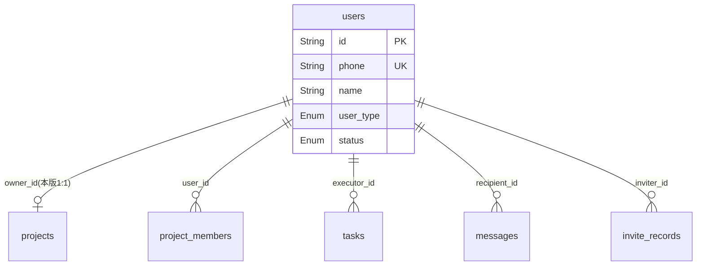
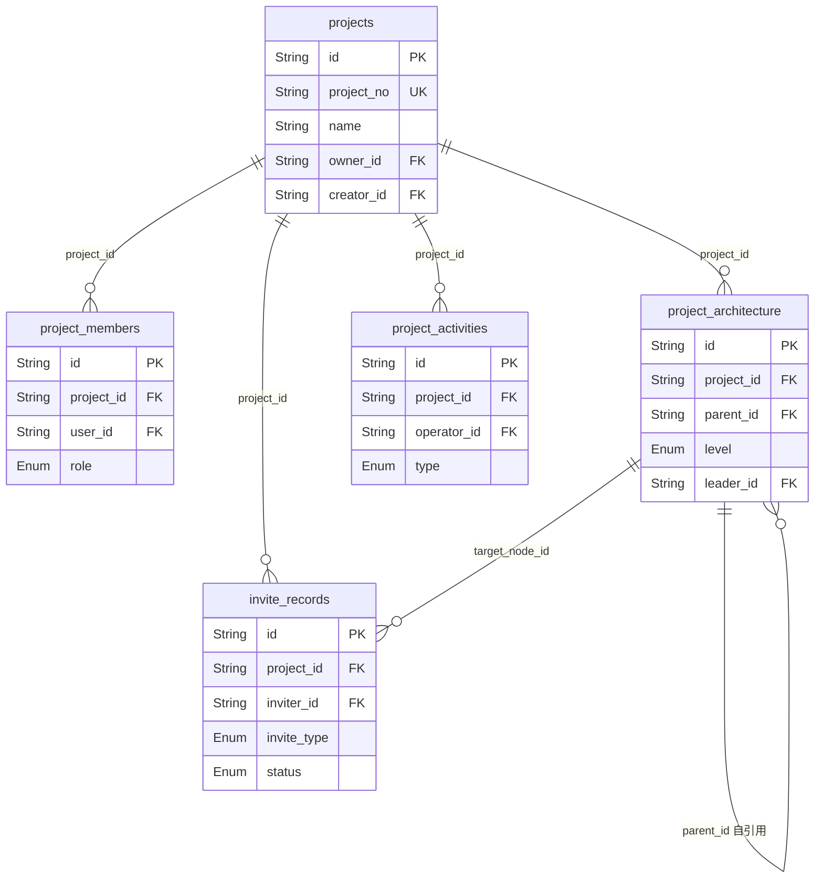
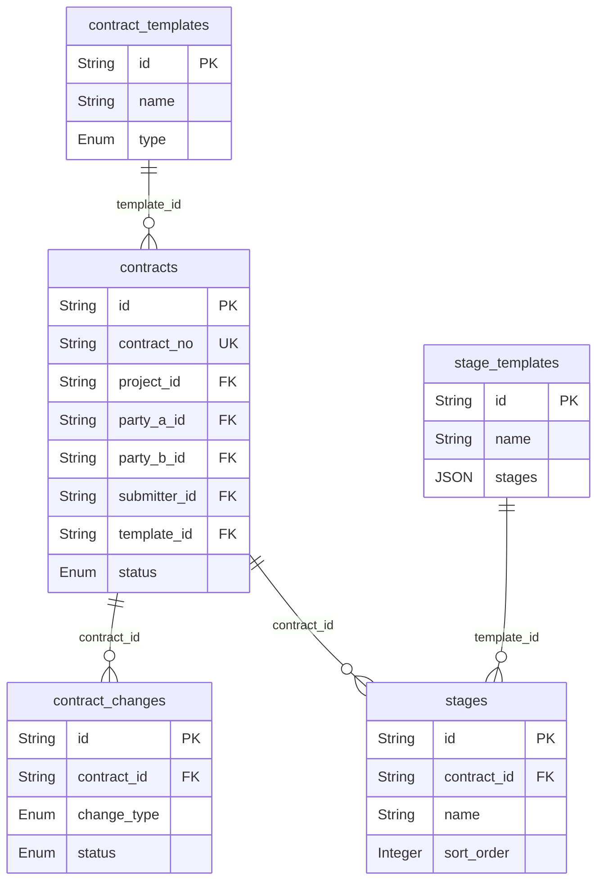
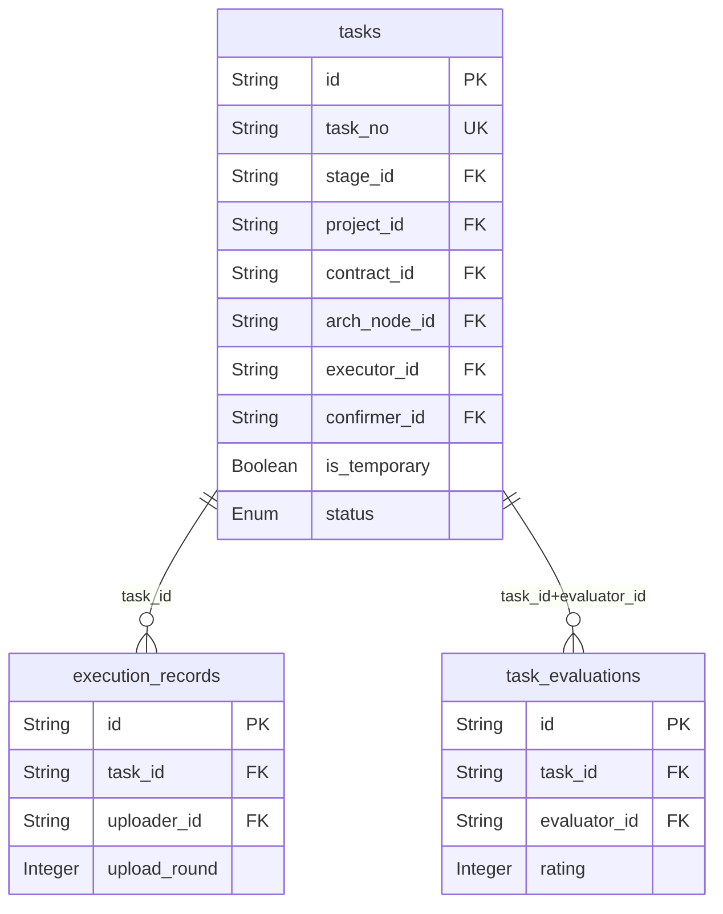
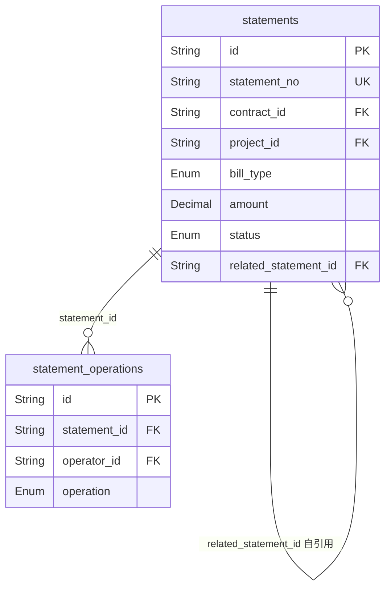

# 良造家管理平台 — 数据库ER图与索引设计方案

> **文档信息**
> - 创建日期：2026-07-27
> - 文档版本：v1.0
> - 定位：补充技术规格补充文档中缺失的ER关系图、索引策略、分库分表方案
> - 数据源：技术规格补充文档 第1节「数据模型与字段定义」中的18张表 + 原型/PRD梳理新增1张表

---

## 目录

1. [表关系ER图](#1-表关系er图)
2. [关系详细说明](#2-关系详细说明)
3. [索引策略](#3-索引策略)
4. [分库分表方案](#4-分库分表方案)

---

## 1. 表关系ER图

### 1.0 数据表清单（共19张）

| 序号 | 表名 | 来源 | 说明 |
|------|------|------|------|
| 1 | users | 技术规格补充文档 1.1 | 用户表 |
| 2 | projects | 技术规格补充文档 1.2 | 项目表 |
| 3 | project_members | 技术规格补充文档 1.3 | 项目成员表 |
| 4 | project_architecture | 技术规格补充文档 1.4 | 项目架构表 |
| 5 | contracts | 技术规格补充文档 1.5 | 合同表 |
| 6 | contract_changes | 技术规格补充文档 1.6 | 合同变更记录表 |
| 7 | stages | 技术规格补充文档 1.7 | 阶段表 |
| 8 | tasks | 技术规格补充文档 1.8 | 任务表 |
| 9 | execution_records | 技术规格补充文档 1.9 | 执行记录表 |
| 10 | statements | 技术规格补充文档 1.10 | 对账单表 |
| 11 | statement_operations | 技术规格补充文档 1.11 | 对账单操作记录表 |
| 12 | task_evaluations | 技术规格补充文档 1.12 | 任务评价表 |
| 13 | contract_templates | 技术规格补充文档 1.13 | 合同文本模板表 |
| 14 | stage_templates | 技术规格补充文档 1.14 | 阶段任务模板表 |
| 15 | messages | 技术规格补充文档 1.15 | 消息表 |
| 16 | shares | 技术规格补充文档 1.16 | 分享记录表 |
| 17 | project_activities | 技术规格补充文档 1.17 | 项目动态表 |
| 18 | 数据字典 | 技术规格补充文档 1.18 | 非独立表，为枚举定义 |
| 19 | invite_records | **原型/PRD梳理新增** | 邀请记录表 |

> **业务规则约束：**
> - 本版一个业主仅一个项目（users.id 为 owner 时，在 projects 表中仅一条记录）
> - 一个任务对于每个确认人仅一条评价（task_evaluations 唯一索引调整为 task_id + confirmer_id）

### 1.1 全局ER图（Mermaid）

```mermaid
erDiagram
    users {
        String id PK "UUID主键"
        String phone UK "手机号"
        String name "姓名"
        String avatar "头像URL"
        Enum user_type "service/owner/admin"
        Boolean promoter_verified "推广人认证"
        String promoter_code "推广人码"
        Enum status "active/disabled"
        DateTime last_login_at "最后登录"
        DateTime created_at "创建时间"
        DateTime updated_at "更新时间"
        DateTime deleted_at "软删除"
    }

    projects {
        String id PK "UUID主键"
        String project_no UK "项目编号PJ+日期+流水号"
        String name "项目名称"
        Enum type "decoration/partial/repair"
        String address "项目地址"
        String city_code "城市编码"
        Decimal budget "项目预算"
        Date start_date "计划开工"
        Date end_date "计划竣工"
        Enum status "pending/in_progress/completed/terminated"
        String owner_id FK "业主用户ID(本版一个业主仅一个项目)"
        String creator_id FK "创建人用户ID"
        Text description "项目描述"
        DateTime created_at "创建时间"
        DateTime updated_at "更新时间"
        DateTime deleted_at "软删除"
    }

    project_members {
        String id PK "UUID主键"
        String project_id FK "关联projects.id"
        String user_id FK "关联users.id"
        Enum role "project_manager/foreman/worker/supervisor/owner"
        Enum join_method "invite/scan/assign"
        Enum status "active/removed"
        DateTime joined_at "加入时间"
        DateTime removed_at "移除时间"
        DateTime created_at "创建时间"
        DateTime updated_at "更新时间"
    }

    project_architecture {
        String id PK "UUID主键"
        String project_id FK "关联projects.id"
        String parent_id FK "父级节点ID(自引用)"
        Enum level "1_department/2_group/3_team/4_package"
        String name "节点名称"
        String leader_id FK "负责人用户ID"
        Integer sort_order "排序"
        Enum status "active/inactive"
        DateTime created_at "创建时间"
        DateTime updated_at "更新时间"
    }

    contracts {
        String id PK "UUID主键"
        String contract_no UK "合同编号HT+日期+流水号"
        String project_id FK "关联projects.id"
        String name "合同名称"
        Enum type "base_construction/hydropower/carpentry/masonry/painting/overall"
        Decimal amount "合同金额"
        String party_a_id FK "甲方用户ID"
        String party_b_id FK "乙方用户ID"
        Enum status "drafting/pending_review/pending_confirm/pending_sign/signed/changing/change_pending_confirm/completed"
        JSON contract_body "合同正文结构化内容"
        JSON attachments "附件列表"
        String template_id FK "合同模板ID"
        String reject_reason "驳回原因"
        String submitter_id FK "发起方用户ID"
        String reviewed_by FK "审核人用户ID"
        DateTime reviewed_at "审核时间"
        DateTime confirmed_at "业主确认时间"
        DateTime signed_at "签约时间"
        Integer version "版本号"
        DateTime created_at "创建时间"
        DateTime updated_at "更新时间"
        DateTime deleted_at "软删除"
    }

    contract_changes {
        String id PK "UUID主键"
        String contract_id FK "关联contracts.id"
        Enum change_type "content/amount/party/other"
        Text change_reason "变更原因"
        JSON change_content "变更内容快照"
        Enum status "pending_review/approved/rejected/pending_confirm/effective"
        String submitter_id FK "发起人用户ID"
        String reviewer_id FK "审核人ID"
        String reviewer_remark "审核备注"
        String confirmed_by FK "业主确认人ID"
        DateTime created_at "创建时间"
        DateTime updated_at "更新时间"
    }

    stages {
        String id PK "UUID主键"
        String contract_id FK "关联contracts.id"
        String name "阶段名称"
        Integer sort_order "阶段顺序"
        Enum status "pending/in_progress/completed"
        String template_id FK "来源模板ID"
        DateTime created_at "创建时间"
        DateTime updated_at "更新时间"
    }

    tasks {
        String id PK "UUID主键"
        String task_no UK "任务编号TK+日期+流水号"
        String stage_id FK "关联stages.id(临时任务为null)"
        String project_id FK "关联projects.id"
        String contract_id FK "关联contracts.id"
        String arch_node_id FK "关联project_architecture.id"
        String name "任务名称"
        Boolean is_temporary "是否临时任务"
        Text execution_standard "执行标准"
        Text confirmation_standard "确认标准"
        Text responsibility_standard "担责标准"
        Enum status "pending/in_progress/confirming/completed"
        String executor_id FK "执行人用户ID"
        String confirmer_id FK "确认人用户ID"
        DateTime start_at "开始时间"
        DateTime submit_at "提交验收时间"
        DateTime complete_at "完成时间"
        String reject_reason "驳回原因"
        Integer reject_count "驳回次数"
        Integer sort_order "排序"
        DateTime created_at "创建时间"
        DateTime updated_at "更新时间"
    }

    execution_records {
        String id PK "UUID主键"
        String task_id FK "关联tasks.id"
        String uploader_id FK "上传人用户ID"
        Text content "说明文字"
        JSON media_files "媒体文件列表"
        Integer upload_round "上传轮次"
        DateTime created_at "创建时间"
    }

    statements {
        String id PK "UUID主键"
        String statement_no UK "对账单编号DZ+日期+流水号"
        String contract_id FK "关联contracts.id"
        String project_id FK "关联projects.id"
        Enum bill_type "worker_wage/material/measure/insurance/foreman_wage"
        Decimal amount "金额"
        String purpose "用途描述"
        Enum status "pending/effective/paid/rejected"
        String submitter_id FK "提交人用户ID"
        String confirmer_id FK "确认人用户ID"
        DateTime confirmed_at "确认时间"
        String reject_reason "驳回原因"
        String related_statement_id FK "关联原对账单ID(自引用)"
        JSON voucher_files "支付凭证"
        String voucher_uploader_id FK "凭证上传人ID"
        DateTime voucher_uploaded_at "凭证上传时间"
        DateTime created_at "创建时间"
        DateTime updated_at "更新时间"
    }

    statement_operations {
        String id PK "UUID主键"
        String statement_id FK "关联statements.id"
        String operator_id FK "操作人用户ID"
        Enum operation "create/confirm/reject/resubmit/upload_voucher"
        String remark "操作备注"
        DateTime created_at "创建时间"
    }

    task_evaluations {
        String id PK "UUID主键"
        String task_id FK "关联tasks.id"
        String evaluator_id FK "评价人用户ID(即确认人)"
        Integer rating "星级1-5"
        JSON tags "评价标签"
        Text comment "文字评价"
        DateTime created_at "创建时间"
    }

    contract_templates {
        String id PK "UUID主键"
        String name "模板名称"
        Enum type "合同类型枚举"
        String city_code "适用城市编码"
        JSON body_template "合同正文模板"
        JSON stages_template "默认阶段任务模板"
        Enum status "active/disabled"
        String creator_id FK "创建人用户ID"
        Integer version "模板版本号"
        DateTime created_at "创建时间"
        DateTime updated_at "更新时间"
    }

    stage_templates {
        String id PK "UUID主键"
        String name "模板名称"
        String city_code "适用城市编码"
        Enum project_type "适用项目类型"
        JSON stages "阶段任务结构"
        Enum status "active/disabled"
        String creator_id FK "创建人用户ID"
        DateTime created_at "创建时间"
        DateTime updated_at "更新时间"
    }

    messages {
        String id PK "UUID主键"
        String recipient_id FK "接收人用户ID"
        String sender_id FK "发送人用户ID"
        Enum type "消息类型枚举"
        String title "消息标题"
        Text content "消息内容"
        Enum link_type "contract/task/statement/project/change"
        String link_id "关联业务对象ID"
        Boolean is_read "是否已读"
        DateTime read_at "已读时间"
        DateTime created_at "创建时间"
    }

    shares {
        String id PK "UUID主键"
        String sharer_id FK "分享人用户ID"
        Enum target_type "project/contract/task/statement"
        String target_id "分享对象ID"
        String share_code UK "分享码"
        DateTime expire_at "过期时间"
        Integer max_views "最大查看次数"
        Integer view_count "已查看次数"
        DateTime created_at "创建时间"
    }

    project_activities {
        String id PK "UUID主键"
        String project_id FK "关联projects.id"
        Enum type "活动类型枚举"
        String operator_id FK "操作人用户ID"
        Enum target_type "contract/task/statement/member"
        String target_id "关联对象ID"
        String description "动态描述"
        DateTime created_at "创建时间"
    }

    invite_records {
        String id PK "UUID主键"
        String project_id FK "关联projects.id"
        String inviter_id FK "邀请人用户ID"
        Enum invite_type "qrcode/link/phone"
        String invite_code UK "邀请码/分享码"
        Enum target_role "project_manager/foreman/worker/supervisor"
        String target_node_id FK "关联架构节点ID(扫码加入时)"
        DateTime expire_at "过期时间(默认7天)"
        Enum status "pending/used/expired/cancelled"
        String used_by FK "使用人用户ID"
        DateTime used_at "使用时间"
        DateTime created_at "创建时间"
        DateTime updated_at "更新时间"
    }

    %% ========== 关系定义 ==========

    users ||--o| projects : "owner_id 业主(本版1:1)"
    users ||--o{ projects : "creator_id 创建人"
    users ||--o{ project_members : "user_id 成员"
    users ||--o{ project_architecture : "leader_id 负责人"
    users ||--o{ contracts : "party_a_id 甲方"
    users ||--o{ contracts : "party_b_id 乙方"
    users ||--o{ contracts : "submitter_id 发起方"
    users ||--o{ contracts : "reviewed_by 审核人"
    users ||--o{ contract_changes : "submitter_id 发起人"
    users ||--o{ contract_changes : "reviewer_id 审核人"
    users ||--o{ contract_changes : "confirmed_by 确认人"
    users ||--o{ tasks : "executor_id 执行人"
    users ||--o{ tasks : "confirmer_id 确认人"
    users ||--o{ execution_records : "uploader_id 上传人"
    users ||--o{ statements : "submitter_id 提交人"
    users ||--o{ statements : "confirmer_id 确认人"
    users ||--o{ statements : "voucher_uploader_id 凭证上传人"
    users ||--o{ statement_operations : "operator_id 操作人"
    users ||--o{ task_evaluations : "evaluator_id 评价人"
    users ||--o{ contract_templates : "creator_id 创建人"
    users ||--o{ stage_templates : "creator_id 创建人"
    users ||--o{ messages : "recipient_id 接收人"
    users ||--o{ messages : "sender_id 发送人"
    users ||--o{ shares : "sharer_id 分享人"
    users ||--o{ project_activities : "operator_id 操作人"
    users ||--o{ invite_records : "inviter_id 邀请人"
    users ||--o{ invite_records : "used_by 使用人"

    projects ||--o{ project_members : "project_id"
    projects ||--o{ project_architecture : "project_id"
    projects ||--o{ contracts : "project_id"
    projects ||--o{ tasks : "project_id"
    projects ||--o{ statements : "project_id"
    projects ||--o{ project_activities : "project_id"
    projects ||--o{ invite_records : "project_id"

    project_architecture ||--o{ project_architecture : "parent_id 自引用树形"
    project_architecture ||--o{ tasks : "arch_node_id 架构节点"
    project_architecture ||--o{ invite_records : "target_node_id 邀请加入的节点"

    contracts ||--o{ contract_changes : "contract_id"
    contracts ||--o{ stages : "contract_id"
    contracts ||--o{ tasks : "contract_id"
    contracts ||--o{ statements : "contract_id"

    stages ||--o{ tasks : "stage_id(临时任务可为null)"

    tasks ||--o{ execution_records : "task_id"
    tasks ||--o{ task_evaluations : "task_id(每个确认人一条)"

    statements ||--o{ statement_operations : "statement_id"
    statements ||--o{ statements : "related_statement_id 自引用(驳回重提)"
```



### 1.2 分域ER图

为便于阅读，将全局ER图按业务域拆分为5个子图。

#### 1.2.1 用户域



#### 1.2.2 项目域



#### 1.2.3 合同域



#### 1.2.4 任务域



#### 1.2.5 对账单域



---

## 2. 关系详细说明

### 2.1 外键关系汇总

| 序号 | 源表 | 外键字段 | 目标表 | 目标字段 | 关系类型 | 说明 |
|------|------|----------|--------|----------|----------|------|
| 1 | projects | owner_id | users | id | N:1 | 本版一个业主仅一个项目 |
| 2 | projects | creator_id | users | id | N:1 | 创建人 |
| 3 | project_members | project_id | projects | id | N:1 | 联合唯一(project_id, user_id) |
| 4 | project_members | user_id | users | id | N:1 | — |
| 5 | project_architecture | project_id | projects | id | N:1 | — |
| 6 | project_architecture | parent_id | project_architecture | id | 自引用1:N | 树形结构(L1→L2→L3→L4) |
| 7 | project_architecture | leader_id | users | id | N:1 | 节点负责人 |
| 8 | contracts | project_id | projects | id | N:1 | 一个项目可有多个合同 |
| 9 | contracts | party_a_id | users | id | N:1 | 甲方(通常为业主) |
| 10 | contracts | party_b_id | users | id | N:1 | 乙方(服务方) |
| 11 | contracts | submitter_id | users | id | N:1 | 合同发起方 |
| 12 | contracts | reviewed_by | users | id | N:1 | 运营审核人 |
| 13 | contracts | template_id | contract_templates | id | N:1 | 使用的合同模板 |
| 14 | contract_changes | contract_id | contracts | id | N:1 | 一个合同可有多次变更 |
| 15 | contract_changes | submitter_id | users | id | N:1 | 变更发起人 |
| 16 | contract_changes | reviewer_id | users | id | N:1 | 变更审核人 |
| 17 | contract_changes | confirmed_by | users | id | N:1 | 业主确认人 |
| 18 | stages | contract_id | contracts | id | N:1 | 一个合同可有多个阶段 |
| 19 | stages | template_id | stage_templates | id | N:1 | 来源模板 |
| 20 | tasks | stage_id | stages | id | N:1 | 临时任务可为null |
| 21 | tasks | project_id | projects | id | N:1 | — |
| 22 | tasks | contract_id | contracts | id | N:1 | 可为null(临时任务) |
| 23 | tasks | arch_node_id | project_architecture | id | N:1 | 可为null |
| 24 | tasks | executor_id | users | id | N:1 | 执行人 |
| 25 | tasks | confirmer_id | users | id | N:1 | 确认人 |
| 26 | execution_records | task_id | tasks | id | N:1 | 一个任务多条记录 |
| 27 | execution_records | uploader_id | users | id | N:1 | 上传人 |
| 28 | statements | contract_id | contracts | id | N:1 | — |
| 29 | statements | project_id | projects | id | N:1 | — |
| 30 | statements | submitter_id | users | id | N:1 | — |
| 31 | statements | confirmer_id | users | id | N:1 | — |
| 32 | statements | voucher_uploader_id | users | id | N:1 | — |
| 33 | statements | related_statement_id | statements | id | 自引用N:1 | 驳回重提关联原单 |
| 34 | statement_operations | statement_id | statements | id | N:1 | — |
| 35 | statement_operations | operator_id | users | id | N:1 | — |
| 36 | task_evaluations | task_id | tasks | id | N:1 | 每个确认人一条评价 |
| 37 | task_evaluations | evaluator_id | users | id | N:1 | 评价人即确认人 |
| 38 | contract_templates | creator_id | users | id | N:1 | — |
| 39 | stage_templates | creator_id | users | id | N:1 | — |
| 40 | messages | recipient_id | users | id | N:1 | — |
| 41 | messages | sender_id | users | id | N:1 | null为系统消息 |
| 42 | shares | sharer_id | users | id | N:1 | — |
| 43 | project_activities | project_id | projects | id | N:1 | — |
| 44 | project_activities | operator_id | users | id | N:1 | — |
| 45 | invite_records | project_id | projects | id | N:1 | — |
| 46 | invite_records | inviter_id | users | id | N:1 | 邀请人 |
| 47 | invite_records | target_node_id | project_architecture | id | N:1 | 可为null |
| 48 | invite_records | used_by | users | id | N:1 | 可为null |

### 2.2 特殊关系说明

| 关系 | 说明 |
|------|------|
| users → projects (owner_id) | **本版约束：一个业主仅一个项目**，需在应用层或数据库约束保证 |
| project_architecture 自引用 | `parent_id` 引用自身 `id`，形成4级树形结构：项目部(L1)→工作组(L2)→施工组(L3)→任务包(L4) |
| task_evaluations(task_id, evaluator_id) | **每个确认人仅一条评价**，唯一索引为(task_id, evaluator_id)联合唯一，而非仅task_id |
| statements 自引用 | `related_statement_id` 引用自身 `id`，对账单驳回后重新提交时关联原单 |
| tasks.stage_id 可空 | 临时任务(is_temporary=true)不关联合同阶段，stage_id为null |
| tasks.contract_id 可空 | 临时任务可不关联合同 |
| messages.sender_id 可空 | null表示系统消息 |
| contracts.template_id 可空 | 可不使用模板手动创建 |
| invite_records.target_node_id 可空 | 邀请加入项目时不一定指定架构节点 |
| invite_records.used_by 可空 | 未使用时为null |

### 2.3 invite_records 表字段定义

> 来源：原型中成员页/架构页的邀请功能（二维码7天有效、链接分享、手机号邀请）

| 字段名 | 类型 | 必填 | 默认值 | 说明 |
|--------|------|------|--------|------|
| id | String(UUID) | 是 | — | 主键 |
| project_id | String(UUID) | 是 | — | 关联 projects.id |
| inviter_id | String(UUID) | 是 | — | 邀请人用户ID |
| invite_type | Enum | 是 | — | 枚举：`qrcode`（二维码邀请）、`link`（链接邀请）、`phone`（手机号邀请） |
| invite_code | String(32) | 是 | — | 邀请码/分享码，唯一 |
| target_role | Enum | 是 | — | 枚举：`project_manager`、`foreman`、`worker`、`supervisor` |
| target_node_id | String(UUID) | 否 | null | 关联 project_architecture.id（扫码加入指定架构节点时使用） |
| expire_at | DateTime | 是 | — | 过期时间（二维码/链接默认7天，手机号邀请不过期） |
| status | Enum | 是 | `pending` | 枚举：`pending`（待使用）、`used`（已使用）、`expired`（已过期）、`cancelled`（已取消） |
| used_by | String(UUID) | 否 | null | 使用人用户ID |
| used_at | DateTime | 否 | null | 使用时间 |
| created_at | DateTime | 是 | now() | 创建时间 |
| updated_at | DateTime | 是 | now() | 更新时间 |

---

## 3. 索引策略

### 3.1 索引设计原则

1. **主键索引**：所有表 `id` 字段，UUID主键，B+Tree索引
2. **唯一索引**：业务编号、手机号等需全局唯一的字段
3. **联合索引**：基于高频查询场景设计，遵循最左前缀匹配原则
4. **全文索引**：仅对需要模糊搜索的业务字段使用
5. **避免过度索引**：写入频繁的表（execution_records、project_activities）仅保留必要索引

### 3.2 主键索引（19个）

每张表 `id` 字段自动创建主键索引，此处不赘述。

### 3.3 唯一索引

| 序号 | 表名 | 索引字段 | 索引名 | 说明 |
|------|------|----------|--------|------|
| U1 | users | phone | uk_users_phone | 手机号全局唯一 |
| U2 | projects | project_no | uk_projects_project_no | 项目编号唯一(PJ+日期+流水号) |
| U3 | projects | owner_id | uk_projects_owner_id | **本版约束：一个业主仅一个项目** |
| U4 | contracts | contract_no | uk_contracts_contract_no | 合同编号唯一(HT+日期+流水号) |
| U5 | tasks | task_no | uk_tasks_task_no | 任务编号唯一(TK+日期+流水号) |
| U6 | statements | statement_no | uk_statements_statement_no | 对账单编号唯一(DZ+日期+流水号) |
| U7 | shares | share_code | uk_shares_share_code | 分享码唯一 |
| U8 | invite_records | invite_code | uk_invite_records_invite_code | 邀请码唯一 |

### 3.4 联合唯一索引

| 序号 | 表名 | 索引字段 | 索引名 | 说明 |
|------|------|----------|--------|------|
| U9 | project_members | (project_id, user_id) | uk_project_members_project_user | 同一项目同一用户仅一条记录 |
| U10 | task_evaluations | (task_id, evaluator_id) | uk_task_evaluations_task_evaluator | **每个确认人仅一条评价** |

### 3.5 联合查询索引

基于API接口清单（技术规格补充文档4.3节）和PRD各模块API汇总中的查询场景设计：

| 序号 | 表名 | 索引字段 | 索引名 | 查询场景 |
|------|------|----------|--------|----------|
| C1 | projects | (status, created_at DESC) | idx_projects_status_created | 项目列表按状态筛选+排序 |
| C2 | projects | (owner_id, status) | idx_projects_owner_status | 业主查看自己的项目(配合U3唯一索引) |
| C3 | projects | (city_code, status) | idx_projects_city_status | 按城市筛选项目(运营端) |
| C4 | project_members | (user_id, status) | idx_project_members_user_status | 用户查看加入的项目 |
| C5 | project_members | (project_id, role) | idx_project_members_project_role | 项目成员按角色筛选 |
| C6 | project_architecture | (project_id, parent_id) | idx_project_arch_project_parent | 查询某项目某节点下的子节点 |
| C7 | project_architecture | (project_id, level) | idx_project_arch_project_level | 按层级查询架构节点 |
| C8 | contracts | (project_id, status) | idx_contracts_project_status | 项目下的合同列表(按状态筛选) |
| C9 | contracts | (status, created_at DESC) | idx_contracts_status_created | PC端合同审核列表 |
| C10 | contracts | (submitter_id, status) | idx_contracts_submitter_status | 合同发起方查看自己的合同 |
| C11 | contract_changes | (contract_id, created_at DESC) | idx_contract_changes_contract_created | 合同变更记录列表 |
| C12 | stages | (contract_id, sort_order) | idx_stages_contract_sort | 合同阶段按顺序排列 |
| C13 | tasks | (project_id, status) | idx_tasks_project_status | 项目下任务列表(按状态筛选) |
| C14 | tasks | (stage_id, sort_order) | idx_tasks_stage_sort | 阶段下任务按顺序排列 |
| C15 | tasks | (executor_id, status) | idx_tasks_executor_status | 执行人查看自己的任务 |
| C16 | tasks | (contract_id, status) | idx_tasks_contract_status | 合同下任务列表 |
| C17 | tasks | (arch_node_id) | idx_tasks_arch_node | 架构节点下关联任务 |
| C18 | execution_records | (task_id, upload_round) | idx_execution_records_task_round | 按轮次查询执行记录 |
| C19 | statements | (contract_id, status) | idx_statements_contract_status | 合同下对账单列表(按状态筛选) |
| C20 | statements | (project_id, status) | idx_statements_project_status | 项目下对账单汇总 |
| C21 | statements | (submitter_id, status) | idx_statements_submitter_status | 提交人查看自己的对账单 |
| C22 | statement_operations | (statement_id, created_at) | idx_statement_ops_statement_created | 对账单操作记录按时间排序 |
| C23 | messages | (recipient_id, is_read, created_at DESC) | idx_messages_recipient_read_created | 未读消息列表(核心高频查询) |
| C24 | project_activities | (project_id, created_at DESC) | idx_project_activities_project_created | 项目动态列表(按时间倒序) |
| C25 | project_activities | (project_id, type) | idx_project_activities_project_type | 项目动态按类型筛选 |
| C26 | shares | (target_type, target_id) | idx_shares_target | 按分享对象查询分享记录 |
| C27 | contract_templates | (type, status) | idx_contract_templates_type_status | 按类型筛选合同模板 |
| C28 | stage_templates | (city_code, project_type, status) | idx_stage_templates_match | 阶段任务模板匹配查询 |
| C29 | invite_records | (project_id, status) | idx_invite_records_project_status | 项目下邀请记录列表 |
| C30 | invite_records | (invite_type, status) | idx_invite_records_type_status | 按邀请类型筛选 |

### 3.6 全文索引

| 序号 | 表名 | 索引字段 | 索引名 | 说明 |
|------|------|----------|--------|------|
| F1 | projects | (name, address) | ft_projects_name_address | 项目名称+地址模糊搜索 |
| F2 | contracts | (name) | ft_contracts_name | 合同名称模糊搜索 |

> **注意**：全文索引的实现取决于数据库选型。MySQL使用`FULLTEXT`索引，PostgreSQL使用`GIN`索引+`tsvector`。当前项目中文为主，需配置中文分词器（如MySQL的`ngram`解析器，PostgreSQL的`zhparser`）。

### 3.7 索引DDL（MySQL 8.0+）

```sql
-- ============================================================
-- 唯一索引
-- ============================================================

ALTER TABLE users ADD UNIQUE INDEX uk_users_phone (phone);
ALTER TABLE projects ADD UNIQUE INDEX uk_projects_project_no (project_no);
ALTER TABLE projects ADD UNIQUE INDEX uk_projects_owner_id (owner_id);  -- 本版：一个业主仅一个项目
ALTER TABLE contracts ADD UNIQUE INDEX uk_contracts_contract_no (contract_no);
ALTER TABLE tasks ADD UNIQUE INDEX uk_tasks_task_no (task_no);
ALTER TABLE statements ADD UNIQUE INDEX uk_statements_statement_no (statement_no);
ALTER TABLE shares ADD UNIQUE INDEX uk_shares_share_code (share_code);
ALTER TABLE invite_records ADD UNIQUE INDEX uk_invite_records_invite_code (invite_code);

-- ============================================================
-- 联合唯一索引
-- ============================================================

ALTER TABLE project_members ADD UNIQUE INDEX uk_project_members_project_user (project_id, user_id);
ALTER TABLE task_evaluations ADD UNIQUE INDEX uk_task_evaluations_task_evaluator (task_id, evaluator_id);  -- 每个确认人仅一条评价

-- ============================================================
-- 联合查询索引
-- ============================================================

-- 项目表
ALTER TABLE projects ADD INDEX idx_projects_status_created (status, created_at DESC);
ALTER TABLE projects ADD INDEX idx_projects_owner_status (owner_id, status);
ALTER TABLE projects ADD INDEX idx_projects_city_status (city_code, status);

-- 项目成员表
ALTER TABLE project_members ADD INDEX idx_project_members_user_status (user_id, status);
ALTER TABLE project_members ADD INDEX idx_project_members_project_role (project_id, role);

-- 项目架构表
ALTER TABLE project_architecture ADD INDEX idx_project_arch_project_parent (project_id, parent_id);
ALTER TABLE project_architecture ADD INDEX idx_project_arch_project_level (project_id, level);

-- 合同表
ALTER TABLE contracts ADD INDEX idx_contracts_project_status (project_id, status);
ALTER TABLE contracts ADD INDEX idx_contracts_status_created (status, created_at DESC);
ALTER TABLE contracts ADD INDEX idx_contracts_submitter_status (submitter_id, status);

-- 合同变更表
ALTER TABLE contract_changes ADD INDEX idx_contract_changes_contract_created (contract_id, created_at DESC);

-- 阶段表
ALTER TABLE stages ADD INDEX idx_stages_contract_sort (contract_id, sort_order);

-- 任务表
ALTER TABLE tasks ADD INDEX idx_tasks_project_status (project_id, status);
ALTER TABLE tasks ADD INDEX idx_tasks_stage_sort (stage_id, sort_order);
ALTER TABLE tasks ADD INDEX idx_tasks_executor_status (executor_id, status);
ALTER TABLE tasks ADD INDEX idx_tasks_contract_status (contract_id, status);
ALTER TABLE tasks ADD INDEX idx_tasks_arch_node (arch_node_id);

-- 执行记录表
ALTER TABLE execution_records ADD INDEX idx_execution_records_task_round (task_id, upload_round);

-- 对账单表
ALTER TABLE statements ADD INDEX idx_statements_contract_status (contract_id, status);
ALTER TABLE statements ADD INDEX idx_statements_project_status (project_id, status);
ALTER TABLE statements ADD INDEX idx_statements_submitter_status (submitter_id, status);

-- 对账单操作记录表
ALTER TABLE statement_operations ADD INDEX idx_statement_ops_statement_created (statement_id, created_at);

-- 消息表
ALTER TABLE messages ADD INDEX idx_messages_recipient_read_created (recipient_id, is_read, created_at DESC);

-- 项目动态表
ALTER TABLE project_activities ADD INDEX idx_project_activities_project_created (project_id, created_at DESC);
ALTER TABLE project_activities ADD INDEX idx_project_activities_project_type (project_id, type);

-- 分享表
ALTER TABLE shares ADD INDEX idx_shares_target (target_type, target_id);

-- 合同模板表
ALTER TABLE contract_templates ADD INDEX idx_contract_templates_type_status (type, status);

-- 阶段任务模板表
ALTER TABLE stage_templates ADD INDEX idx_stage_templates_match (city_code, project_type, status);

-- 邀请记录表
ALTER TABLE invite_records ADD INDEX idx_invite_records_project_status (project_id, status);
ALTER TABLE invite_records ADD INDEX idx_invite_records_type_status (invite_type, status);

-- ============================================================
-- 全文索引（MySQL ngram中文分词）
-- ============================================================

ALTER TABLE projects ADD FULLTEXT INDEX ft_projects_name_address (name, address) WITH PARSER ngram;
ALTER TABLE contracts ADD FULLTEXT INDEX ft_contracts_name (name) WITH PARSER ngram;
```

### 3.8 索引统计汇总

| 索引类型 | 数量 | 占比 |
|----------|------|------|
| 主键索引 | 19 | 30.6% |
| 唯一索引 | 10 | 16.1% |
| 联合查询索引 | 30 | 48.4% |
| 全文索引 | 2 | 3.2% |
| **合计** | **61** | 100% |

| 表名 | 索引数量 | 说明 |
|------|----------|------|
| tasks | 6 | 查询维度最多(项目/阶段/合同/执行人/架构节点) |
| projects | 5 | 含owner_id唯一索引(1:1约束) |
| contracts | 4 | 多维度查询 |
| statements | 4 | 多维度查询 |
| invite_records | 3 | 新增表 |
| project_members | 3 | — |
| project_architecture | 3 | — |
| project_activities | 3 | — |
| messages | 1(联合) | 但覆盖核心未读查询场景 |
| execution_records | 1(联合) | 写入频繁，索引精简 |
| 其余表 | 1-2 | — |

---

## 4. 分库分表方案

### 4.1 数据量预估

| 表名 | 单项目数据量(估算) | 10万项目总量 | 3年增长倍数 | 3年后预估 |
|------|-------------------|-------------|------------|-----------|
| users | — | 50万 | 3x | 150万 |
| projects | 1 | 10万 | 3x | 30万 |
| project_members | 10 | 100万 | 3x | 300万 |
| project_architecture | 30 | 300万 | 3x | 900万 |
| contracts | 3 | 30万 | 4x | 120万 |
| contract_changes | 1 | 10万 | 4x | 40万 |
| stages | 30 | 300万 | 4x | 1200万 |
| tasks | 100 | 1000万 | 4x | 4000万 |
| execution_records | 300 | 3000万 | 5x | 1.5亿 |
| statements | 20 | 200万 | 5x | 1000万 |
| statement_operations | 40 | 400万 | 5x | 2000万 |
| task_evaluations | 80 | 800万 | 3x | 2400万 |
| messages | 500 | 5000万 | 5x | 2.5亿 |
| project_activities | 500 | 5000万 | 5x | 2.5亿 |
| invite_records | 5 | 50万 | 3x | 150万 |
| shares | 5 | 50万 | 3x | 150万 |
| contract_templates | — | 100 | 2x | 200 |
| stage_templates | — | 50 | 2x | 100 |

> **预估依据**：家装行业单个项目平均3个合同、10阶段/合同、30任务/阶段、3轮执行记录/任务。3年后项目总量按30万估算。本版一个业主仅一个项目，projects与users(owner)为1:1关系。

### 4.2 当前阶段结论：不需要分库分表

**理由：**

1. **3年内数据量可控**：最大的表(execution_records)约1.5亿行，messages/project_activities约2.5亿行。在合理索引下，单表MySQL 8.0可支撑到5亿行级别。
2. **查询均带条件**：几乎所有查询都携带 `project_id` 或 `user_id` 过滤条件，索引命中率高。
3. **分库分表代价大**：引入分片中间件(ShardingSphere/Vitess)增加运维复杂度、跨片查询困难、分布式事务成本高。
4. **MVP阶段优先简单**：当前为产品验证期，应优先保证开发效率和系统稳定性。

### 4.3 当前替代方案：读写分离 + 冷热分离

在不分库分表的前提下，通过以下策略应对数据增长：

#### 4.3.1 MySQL读写分离

```
┌─────────────┐
│  应用服务    │
└──────┬──────┘
       │
  ┌────▼────┐
  │  代理层   │ (ProxySQL / MySQL Router)
  └─┬─────┬─┘
    │     │
┌───▼──┐ ┌▼────┐
│ 主库  │ │ 从库 │ (1-2个只读副本)
│ WRITE │ │ READ │
└──────┘ └─────┘
```

- **写操作**：全部走主库
- **读操作**：列表查询、统计查询走从库
- **延迟控制**：从库延迟<100ms，对业务无感知

#### 4.3.2 冷热数据分离（归档策略）

针对数据量增长最快的表，实施冷热分离：

| 表名 | 热数据定义 | 冷数据处理 | 归档方式 |
|------|-----------|-----------|----------|
| messages | 90天内 | 超期归档到 `messages_archive` 表 | 定时任务每日归档 |
| project_activities | 90天内 | 超期归档到 `activities_archive` 表 | 定时任务每日归档 |
| execution_records | 项目状态非terminated | 已终止项目归档 | 项目终止时批量归档 |
| invite_records | status=pending | 已使用/已过期超过30天归档 | 定时任务每日归档 |

归档表结构同原表，查询时自动UNION或应用层合并。

#### 4.3.3 大表优化策略

| 策略 | 适用表 | 说明 |
|------|--------|------|
| 分区表(PARTITION) | messages, project_activities | 按月分区，便于归档删除旧分区 |
| JSON字段优化 | contracts.contract_body, stages_template.stages | JSON字段仅存储，不参与索引；查询时应用层解析 |
| 冗余字段减少JOIN | tasks | 已冗余project_id，避免通过stage→contract→project三级JOIN |

### 4.4 未来分库分表预案

当单表数据量超过 **5亿行** 或单表容量超过 **200GB** 时，启动分库分表。预案如下：

#### 4.4.1 分片键选择

| 表名 | 分片键 | 理由 |
|------|--------|------|
| projects | id | 所有业务查询均从项目维度进入 |
| project_members | project_id | 与项目同分片 |
| project_architecture | project_id | 与项目同分片 |
| contracts | project_id | 绝大多数查询带project_id |
| stages | contract_id | 与合同同分片(同project_id) |
| tasks | project_id | 任务查询均带project_id |
| execution_records | task_id | 需使用task的project_id做路由 |
| statements | project_id | 对账单按项目统计 |
| invite_records | project_id | 邀请记录属于项目 |
| messages | recipient_id | 消息按用户维度查询 |
| project_activities | project_id | 动态按项目查询 |

#### 4.4.2 分片策略

```
分库：4库 (db_0, db_1, db_2, db_3)
分表：每库8张表 (table_0 ~ table_7)
总表数：4 × 8 = 32 张逻辑表

分片算法：project_id % 32

数据分布：
  project_id Hash → [0,31] → 库号=Hash/8, 表号=Hash%8
```

#### 4.4.3 不分片表（全局表）

以下表数据量小、查询频率高、需要跨片JOIN，不分片：

| 表名 | 原因 |
|------|------|
| users | 全局用户中心，被所有业务表引用 |
| contract_templates | 数据量极小(<200条) |
| stage_templates | 数据量极小(<100条) |
| shares | 数据量小，需全局唯一share_code查询 |

#### 4.4.4 分片后查询改造要点

| 场景 | 改造方案 |
|------|----------|
| 按project_id查询 | 路由到对应分片，无需跨片 |
| 按user_id查询(如"我的任务") | 需建立 **用户-项目关系索引表** 或走ES |
| 列表排序+分页 | 各分片并行查询后应用层合并排序 |
| 跨项目统计(运营端) | 引入ClickHouse/ES做OLAP分析 |
| 全文搜索 | 从MySQL全文索引迁移到Elasticsearch |

### 4.5 演进路线图

```
阶段0 (当前MVP)
  └── 单库单表 + 合理索引
       │
阶段1 (用户量1万+，数据量<1亿)
  └── 读写分离 + 冷热归档 + 分区表
       │
阶段2 (用户量10万+，数据量1-5亿)
  └── 引入ES处理全文搜索 + ClickHouse做统计分析
       │
阶段3 (用户量50万+，数据量>5亿)
  └── 按project_id分库分表 + 全局表保留
```

---

_文档结束。本方案基于技术规格补充文档 v1.0 中的数据模型定义 + 原型/PRD梳理，后续随业务发展持续迭代。_
